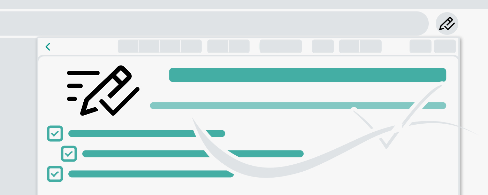

My-Notes - Put your story into notes... \
This is an updated version of the Work-Notes extension.

## Overview:

A simple and useful application to save a quick notes right without leaving a browser.
This extension can sync with Google Drive and encrypt the data if desired... to keep it save, and secure.

## Features
- Markdown it! A plain text format editor for writing structured documents. Based on the [CodeMirror](https://codemirror.net/) with [markdown-it](https://github.com/markdown-it) renderer followed the [CommonMark spec](https://spec.commonmark.org/).
- WYSIWYG-style editing. A Rich content editor ideally, produce clean, semantically meaningful documents while still being easy to understand. Based on the [ProseMirror](https://prosemirror.net/) with the bridge the gap between editing explicit, unambiguous content like Markdown, and classical WYSIWYG editor.
- Automatically saves notes to Google Drive into data file If Authorized on options page. 
- Can encrypt all data synced to the cloud, using AES-GCM encryption with the only key that the user carries.
  - No one can know about sensitive information until decrypted. 
  - Please be noted, if a key is lost, it will be impossible to recover the data. Please remember that key and keep it secret.
- Drag & drop to reorder the notes in a desired order.
- Dark and Light themes. 

This extension is published to the google webstore: https://chrome.google.com/webstore/detail/work-note/ilonmfcpfefeelkojaclhipbfmodbfli

2024 My-Notes.
